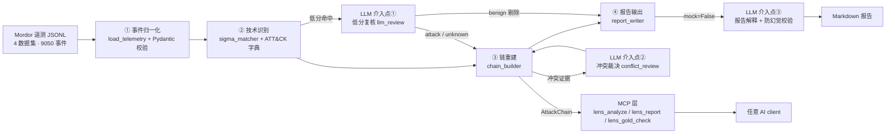

# ThreatLens · EDR 攻击链分析引擎

> 输入主机遥测（Sysmon 事件流），输出 **ATT&CK 技术识别 + 攻击链还原 + 可解释证据链**。确定性规则为主干，LLM 只在三个边界点介入，全部介入点均真实调用 DeepSeek API 并量化评测。

ThreatLens 用公开数据集（Mordor 真实攻击录制 / ATT&CK STIX / Atomic Red Team / Sigma）搭建了一条可复现、可评测的攻击链分析流水线：**规则主干全程无 LLM**，LLM 在"低分证据复核、冲突证据裁决、报告解释"三处介入——并用版本分离评测（脚本 baseline vs 多轮 LLM 介入版）量化验证了这种混合架构的价值：技术识别 precision 从 36.4% 提升到 **57.1%**，recall 100% 全程保持。

---

## 项目简介

SOC 分析师每天要把海量主机遥测手工串成攻击链：哪些事件是一次攻击？用了哪些 ATT&CK 技术？按什么顺序？证据是什么？——这个过程耗时、易错、难复现。

ThreatLens 把这个过程工程化：

- **确定性主干**：Sigma 规则匹配 + ATT&CK 字典 + 时间线重建，全程规则查表、无模型，同输入同输出；
- **可解释证据链**：链上每个技术都能回溯到具体事件（`event_uid`），不是黑盒结论；
- **可量化评测**：用真实攻击数据当考卷、Atomic 金标当标准答案，precision/recall 是真数字，三版快照可复现；
- **LLM 只补边界**：脚本识别能力已满（recall 100%），LLM 在低分复核与冲突裁决两处降噪，让 precision 从 36.4% 到 44.4% 再到 57.1%。

## 核心能力

| 能力 | 说明 |
|---|---|
| 事件归一化 | 兼容 Mordor 旧样本（`EventTime`/顶层字段）与 ECS 变体（`@timestamp`/整型 `EventID`），输出统一 `NormalizedEvent[]` |
| 强类型事件契约 | Pydantic v2 模型 + Field Validation，9050 条真实事件无损通过校验，字段错配在加载期拦截 |
| 技术识别 | Sigma-lite 匹配引擎（`eq`/`contains`/`endswith` + 极简条件语法），2815 条规则按 EventID 预索引加速 |
| 攻击链重建 | 两层时间线（组内时间戳 + 组间战术阶段顺序）+ 去噪打分（硬排除/降权/提权/谱系/聚合 top-K） |
| LLM 低分复核 | 只复核低分命中，结构化输出 `verdict + reason`，`temperature=0` 可复现 |
| LLM 冲突裁决 | 对"规则命中但金标不一致"的冲突证据做裁决，`temperature=0` |
| LLM 报告解释 | 结构化攻击链 → 分析师可读的中文 Markdown 报告，**代码级防幻觉校验**（报告中技术 ID 必须 ⊆ 链上技术集，越界即剔除+审计） |
| 可解释证据链 | 每个技术挂 `event_uid` 证据，可反查原始事件 |
| 量化评测 | precision / recall / 阶段召回，**版本分离**（官方规则 vs 官方+自定义），三版快照制历史对比 |
| MCP 工具封装 | `lens_analyze` / `lens_report` / `lens_gold_check` 三个 MCP 工具，任意 AI client（Claude Desktop / Cursor 等）可调用 |

## 效果展示

三版评测对比（同一金标、同一口径，`evaluation/baseline/` 快照可复现）：

| 指标 | v1 脚本 baseline | v2 低分复核 | v3 冲突裁决 | 累计变化 |
|---|---|---|---|---|
| precision | 36.4% | 44.4% | **57.1%** | +20.8pp |
| recall | 100% | 100% | 100% | 持平 |
| 阶段召回 | 100% | 100% | 100% | 持平 |
| 可解释性 | 无 | 106 条复核全部带 reason | + 冲突裁决带理由 | 新增 |

LLM 复核示例（真实判定）：把 `T1055`（进程注入）匹配到的 whoami/conhost 事件识别为 benign（"无进程注入行为"）剔除，`T1033`（powershell 启动 whoami）判 attack 保留——这就是"Agent 比脚本强"的量化证据。

## 快速开始

### 环境要求
- Python 3.10+（开发环境 3.13）
- 依赖：`pip install -r requirements.txt`（pyyaml / pytest / pydantic / mcp）

### 数据准备（4 个公开数据集，共约 454M）

```bash
# 1. ATT&CK 知识库（STIX，858 个技术）
curl -L -o edr/data/attack/enterprise-attack.json \
  "https://raw.githubusercontent.com/mitre-attack/attack-stix-data/master/enterprise-attack/enterprise-attack.json"

# 2. Mordor 真实攻击遥测（4 个数据集 = 一条 4 阶段 demo 链，JSONL）
curl -L -o edr/data/telemetry/empire_launcher_vbs.zip \
  "https://raw.githubusercontent.com/OTRF/Security-Datasets/master/datasets/atomic/windows/execution/host/empire_launcher_vbs.zip"
curl -L -o edr/data/telemetry/empire_mimikatz_logonpasswords.zip \
  "https://raw.githubusercontent.com/OTRF/Security-Datasets/master/datasets/atomic/windows/credential_access/host/empire_mimikatz_logonpasswords.zip"
curl -L -o edr/data/telemetry/cmd_seatbelt_group_user.zip \
  "https://raw.githubusercontent.com/OTRF/Security-Datasets/master/datasets/atomic/windows/discovery/host/cmd_seatbelt_group_user.zip"
curl -L -o edr/data/telemetry/covenant_copy_smb_CreateRequest.zip \
  "https://raw.githubusercontent.com/OTRF/Security-Datasets/master/datasets/atomic/windows/lateral_movement/host/covenant_copy_smb_CreateRequest.zip"
python -c "import zipfile,glob;[zipfile.ZipFile(f).extractall('edr/data/telemetry') for f in glob.glob('edr/data/telemetry/*.zip')]"

# 3. Atomic Red Team（eval 金标，sparse clone 只取 atomics/）
git clone --filter=blob:none --sparse https://github.com/redcanaryco/atomic-red-team edr/data/atomic/_src
cd edr/data/atomic/_src && git sparse-checkout set atomics

# 4. Sigma 映射规则（sparse clone 只取 rules/）
git clone --filter=blob:none --sparse https://github.com/SigmaHQ/sigma edr/data/sigma/_src
cd edr/data/sigma/_src && git sparse-checkout set rules
```

> ⚠️ 国内网络注意：请走 `raw.githubusercontent.com` 直连（ghproxy 等镜像当前普遍不可用）。

### 跑 demo（事件 → 技术 → 攻击链）

```bash
python -m threatlens.core.analysis.run_demo
# 输出 outputs/attack_chain_demo.json：13 个技术、覆盖 4 个战术阶段，证据可回溯
```

### 跑评测

```bash
# 脚本版 baseline（纯规则，无 LLM）
python -m threatlens.core.evaluation.run_eval

# Agent 版（脚本主干 + LLM 低分复核 + 冲突裁决；需 DEEPSEEK_API_KEY，或 --mock 离线跑通）
python -m threatlens.core.evaluation.run_eval_agent --mock
# 真实调用：在 .env 配 DEEPSEEK_API_KEY=sk-xxx 后运行（不带 --mock）
```

### 通过 MCP 调用（AI client 集成）

启动 MCP server（stdio 模式，等 client 连接）：

```bash
python -m threatlens.core.mcp.server
```

MCP client（Claude Desktop / Cursor / WorkBuddy 等）配置连接：

```json
{
  "mcpServers": {
    "threatlens": {
      "command": "D:\\AIWorkspace\\ThreatLens\\.venv\\Scripts\\python.exe",
      "args": ["-m", "threatlens.core.mcp.server"],
      "cwd": "D:\\AIWorkspace\\ThreatLens"
    }
  }
}
```

三个工具：

| 工具 | 输入 | 输出 |
|---|---|---|
| `lens_analyze` | 本地遥测 JSONL 路径（`include_custom` 可选） | AttackChain JSON（技术/链/证据）——走确定性主干，无 LLM，快且可复现 |
| `lens_report` | AttackChain JSON 字符串（`mock` 可选，默认 True） | Markdown 攻击链报告（mock=False 走真实 LLM，需 `DEEPSEEK_API_KEY`） |
| `lens_gold_check` | `{"predictions": {"<数据集>": ["Txxxx", ...]}}` | precision / recall / stage_recall（与评测口径一致，即 Benchmark 入口） |

未安装 `mcp` 包时，server 自动降级为本地 CLI（`--analyze` / `--report` / `--gold`），方便无 client 环境下直接调试。

### 跑测试

```bash
python -m pytest tests/ -q    # 108 passed
```

## 系统架构



主干（①–④）**确定性规则查表，全程无 LLM**；LLM 三处介入均在脚本判定完成之后，不参与判定主干（架构红线）。报告解释层（③）是纯展示层，**precision/recall 不变是硬约束**。

## LLM 三介入点

| 介入点 | 位置 | 作用 | 对指标影响 |
|---|---|---|---|
| ① 低分复核 | 技术识别后 | 复核低分命中，剔除误报（如 whoami 无注入行为） | precision 36.4% → 44.4%（+8.1pp） |
| ② 冲突裁决 | 链重建后 | 裁决"规则命中但金标不一致"的冲突证据 | precision 44.4% → 57.1%（+12.7pp） |
| ③ 报告解释 | 报告输出 | 结构化攻击链 → 分析师可读中文报告 | 纯展示层，指标不变（红线） |

共性设计：

- **只复核边界**（① 非金标低分命中；② 冲突证据），量小可控，不拖慢主链；
- **结构化输出**：`{"verdict": "attack"|"benign"|"unknown", "reason": "...", "confidence": 0-1}`；
- **可复现**：`temperature=0` + 每次调用落审计日志；
- **防背答案红线**：prompt 只用通用安全知识，**禁止**引用测试集名称/具体技术结论——否则 precision 提升即循环论证；
- **防幻觉校验**（报告层）：生成后扫描报告中的 `T\d+(\.\d+)?`，凡不属于输入 chain 技术集的一律剔除并告警——"报告事实 ⊆ 链上事实"是代码级断言，不靠 LLM 自觉；
- **失败兜底**：网络/解析失败一律降级（复核判 `unknown` 不误删；报告回退 mock 模板），主链确定性不受影响。

## 技术栈

| 层 | 技术 |
|---|---|
| 语言 | Python 3.10+（3.13 实测） |
| 数据契约 | Pydantic v2（`NormalizedEvent` 强类型 + Field Validation） |
| 检测规则 | Sigma（SigmaHQ 官方 2815 条 + 自定义 1 条） |
| 知识库 | MITRE ATT&CK Enterprise STIX（858 技术） |
| 评测数据 | Mordor / OTRF Security-Datasets（真实攻击录制）、Atomic Red Team（金标） |
| LLM | DeepSeek API（OpenAI 兼容，`temperature=0`） |
| 集成 | MCP（Model Context Protocol，stdio transport，FastMCP） |
| 测试 | pytest（108 用例，全量绿） |
| 文档 | 产品规划书 + 开发说明书 01–07 + ADR 决策记录 |

## 项目结构

```
ThreatLens/
├── docs/                    # 文档层
│   ├── 产品规划书.md
│   ├── 开发说明/            # 01 数据准备 / 02 分析引擎 / 03 评测 / 04 LLM 复核层
│   │                        # 05 事件契约强类型化 / 06 报告真实 LLM 版 / 07 MCP 工具封装
│   └── 决策记录/            # ADR-001 定位 / ADR-003 匹配范围
├── edr/data/                # 数据层（454M，不入库，README 提供下载命令）
│   ├── attack/              #   ATT&CK STIX
│   ├── telemetry/           #   Mordor 真实遥测（JSONL）
│   ├── atomic/              #   Atomic Red Team（金标）
│   └── sigma/               #   Sigma 规则
├── evaluation/              # 评测层
│   ├── baseline/            #   历史快照（v1 脚本版 / v2 低分复核 / v3 冲突裁决，只读）
│   ├── metrics*.json        #   评测指标
│   ├── report*.md           #   评测报告
│   └── reports_agent.jsonl  #   LLM 报告调用审计
├── outputs/                 # demo 输出（AttackChain + Markdown 报告）
├── scripts/                 # 辅助脚本
├── tests/                   # 108 个测试（含 test_mcp_server.py）
├── threatlens/              # 代码主包
│   └── core/
│       ├── collectors/      #   采集（fetch_data）
│       ├── data/            #   load_telemetry / load_attack / load_sigma / load_atomic
│       ├── analysis/        #   sigma_matcher / chain_builder / report_writer / run_demo
│       ├── evaluation/      #   run_eval / run_eval_agent / llm_review / conflict_review
│       └── mcp/             #   server.py（lens_analyze / lens_report / lens_gold_check）
├── .gitignore
├── requirements.txt
└── README.md
```

## 配置说明

| 配置 | 位置 | 说明 |
|---|---|---|
| `DEEPSEEK_API_KEY` | `.env` 或环境变量 | LLM 三介入点真实调用用；缺失时评测用 `--mock` 离线跑通、报告自动降级 mock 模板 |
| 数据目录 | `edr/data/` | 4 个公开数据集，按上文命令下载；不入版本库 |

## 失败场景与降级策略

| 场景 | 触发 | 行为 | 影响 |
|---|---|---|---|
| 无 API key / 网络失败 | LLM 三介入点调用时 | 复核判 `unknown`（不误删）、报告回退 mock 模板 | 指标与报告仍产出，只少 LLM 增量 |
| 文件不存在 / 非法 JSON | `lens_*` 工具调用 | 返回 `{"error": "..."}`，不抛异常 | 调用方可直接读错误消息 |
| 未安装 `mcp` 包 | 启动 server | 降级为本地 CLI（`--analyze` / `--report` / `--gold`） | 功能可用，仅 MCP 协议层缺失 |
| 数据未下载 | 跑 demo / 评测 | 加载器抛错并指明缺失路径 | 需先执行数据准备 |
| LLM 幻觉 | 报告生成后 | 越界技术 ID 剔除 + 审计告警 | 报告事实 ⊆ 链上事实（代码级保证） |

## 安全设计

- **主干确定性兜底**：LLM 全错也不影响规则判定主链（只影响低分命中的去留）；
- **防背答案**：LLM prompt 禁止引用测试集结论，评测"版本分离"（官方 vs 官方+自定义规则）双报告；
- **防幻觉**：报告层代码级校验——LLM 报告中的技术 ID 必须 ⊆ 链上技术集，越界剔除 + 审计；
- **密钥不入库**：`.env` / API key 已 gitignore；
- **证据可审计**：`event_uid` 反查原始事件，LLM 每次调用落审计日志（日志不入库）。

## 项目亮点

- **"Agent 比脚本强"有量化证据**：同一金标、同一口径，v1 36.4% → v2 44.4% → v3 57.1%（累计 +20.8pp）、recall 100% 全程保持、106 条复核全部带 reason——三版快照可复现、可辩护；
- **"主干脚本 + LLM 边界介入"不是口号**：三处介入全真实调用 DeepSeek，架构红线（LLM 不进判定主干、报告层不动指标）写进文档并被测试锁住；
- **全部真实数据**：Mordor 真实攻击录制 + Atomic 金标 + Sigma 官方规则，无编造数据、无预填指标；
- **可被任意 AI client 调用**：MCP 封装（3 个 `lens_*` 工具）让分析能力从命令行变成标准协议服务；
- **踩坑即资产**：实现中修复的条件解析吞 `and/not`（581 条假误报）、`.strip()` 破坏反混淆空格、Sigma 大写字段 vs 事件蛇形字段 3 类真实 bug，均有回归测试。

## Roadmap

- [x] **P0** 数据基座（四源落地）
- [x] **P1** 分析引擎（事件 → 技术 → 攻击链）
- [x] **P2** 评测（baseline 摸底 + 多轮 LLM 介入对比，36.4% → 57.1%）
- [x] **P2 三期** 冲突证据复核、LLM 报告解释（三介入点全部真实调用）
- [x] **P4** MCP 工具封装（`lens_analyze` / `lens_report` / `lens_gold_check`）
- [ ] **P3** IoC 富集扩展（条件触发：先落 Abuse.ch 真实数据）
- [ ] 多智能体编排（采集/报告 Agent，北极星，延后）

## License

MIT
