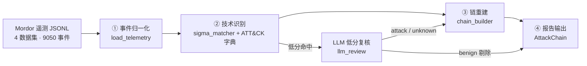
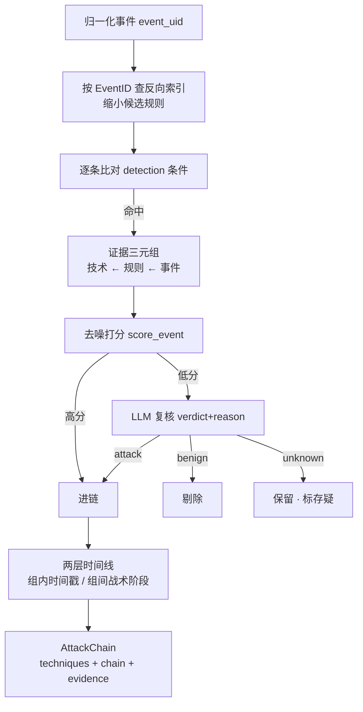

# ThreatLens · EDR 攻击链分析引擎

> 输入主机遥测（Sysmon 事件流），输出 **ATT&CK 技术识别 + 攻击链还原 + 可解释证据链** 的确定性优先分析引擎。

ThreatLens 用**公开数据集**（Mordor 真实攻击录制 / ATT&CK STIX / Atomic Red Team / Sigma）搭建了一条可复现、可评测的攻击链分析流水线：**规则主干全程无 LLM**，LLM 仅在"低分证据复核"这一处介入——并用两版评测（脚本 baseline vs Agent 版）证明了这种混合架构的价值。

---

## 项目简介

SOC 分析师每天要把海量主机遥测手工串成攻击链：哪些事件是一次攻击？用了哪些 ATT&CK 技术？按什么顺序？证据是什么？——这个过程耗时、易错、难复现。

ThreatLens 把这个过程工程化：

- **确定性主干**：Sigma 规则匹配 + ATT&CK 字典 + 时间线重建，全程规则查表、无模型，同输入同输出；
- **可解释证据链**：链上每个技术都能回溯到具体事件（`event_uid`），不是黑盒结论；
- **可量化评测**：用真实攻击数据当考卷、Atomic 金标当标准答案，precision/recall 是真数字；
- **LLM 只补短板**：脚本识别能力已满（recall 100%），LLM 只在"低分证据复核"降噪，让 precision 从 36.4% 提升到 44.4%。

## 核心能力

| 能力 | 说明 |
|---|---|
| 事件归一化 | 兼容 Mordor 旧样本（`EventTime`/顶层字段）与 ECS 变体（`@timestamp`/整型 `EventID`），输出统一 `NormalizedEvent[]` |
| 技术识别 | Sigma-lite 匹配引擎（`eq`/`contains`/`endswith` + 极简条件语法），2816 条规则按 EventID 预索引加速 |
| 攻击链重建 | 两层时间线（组内时间戳 + 组间战术阶段顺序）+ 去噪打分（硬排除/降权/提权/谱系/聚合 top-K） |
| LLM 低分复核 | 只复核低分命中，结构化输出 `verdict + reason`，`temperature=0` 可复现 |
| 可解释证据链 | 每个技术挂 `event_uid` 证据，可反查原始事件 |
| 量化评测 | precision / recall / 阶段召回，**版本分离**（官方规则 vs 官方+自定义），快照制历史对比 |

## 效果展示

两版评测对比（同一金标、同一口径，`evaluation/baseline/` 快照可复现）：

| 指标 | 脚本版 baseline（v1） | Agent 版（v2） | 变化 |
|---|---|---|---|
| precision | 36.4% | **44.4%** | +8.1pp |
| recall | 100% | 100% | 持平 |
| 阶段召回 | 100% | 100% | 持平 |
| 可解释性 | 无 | 106 条复核全部带 reason | 新增 |

LLM 复核示例（真实判定）：把 `T1055`（进程注入）匹配到的 whoami/conhost 事件识别为 benign（"无进程注入行为"）剔除，`T1033`（powershell 启动 whoami）判 attack 保留——这就是"Agent 比脚本强"的量化证据。

## 快速开始

### 环境要求
- Python 3.10+（开发环境 3.13）
- 依赖：`pip install -r requirements.txt`（仅 pyyaml + pytest）

### 数据准备（4 个公开数据集，共约 454M）

```bash
# 1. ATT&CK 知识库（STIX，858 个技术）
curl -L -o edr/data/attack/enterprise-attack.json \
  "https://raw.githubusercontent.com/mitre-attack/attack-stix-data/master/enterprise-attack/enterprise-attack.json"

# 2. Mordor 真实攻击遥测（4 个数据集 = 一条 4 阶段 demo 链，JSONL）
curl -L -o edr/data/telemetry/empire_launcher_vbs.zip \
  "https://raw.githubusercontent.com/OTRF/Security-Datasets/master/datasets/atomic/windows/execution/host/empire_launcher_vbs.zip"
curl -L -o edr/data/telemetry/empire_mimikatz_logonpasswords.zip \
  "https://raw.githubusercontent.com/OTRF/Security-Datasets/master/datasets/atomic/windows/credential_access/host/empire_mimikatz_logonpasswords.zip"
curl -L -o edr/data/telemetry/cmd_seatbelt_group_user.zip \
  "https://raw.githubusercontent.com/OTRF/Security-Datasets/master/datasets/atomic/windows/discovery/host/cmd_seatbelt_group_user.zip"
curl -L -o edr/data/telemetry/covenant_copy_smb_CreateRequest.zip \
  "https://raw.githubusercontent.com/OTRF/Security-Datasets/master/datasets/atomic/windows/lateral_movement/host/covenant_copy_smb_CreateRequest.zip"
python -c "import zipfile,glob;[zipfile.ZipFile(f).extractall('edr/data/telemetry') for f in glob.glob('edr/data/telemetry/*.zip')]"

# 3. Atomic Red Team（eval 金标，sparse clone 只取 atomics/）
git clone --filter=blob:none --sparse https://github.com/redcanaryco/atomic-red-team edr/data/atomic/_src
cd edr/data/atomic/_src && git sparse-checkout set atomics

# 4. Sigma 映射规则（sparse clone 只取 rules/）
git clone --filter=blob:none --sparse https://github.com/SigmaHQ/sigma edr/data/sigma/_src
cd edr/data/sigma/_src && git sparse-checkout set rules
```

> ⚠️ 国内网络注意：请走 `raw.githubusercontent.com` 直连（ghproxy 等镜像当前普遍不可用）。

### 跑 demo（事件 → 技术 → 攻击链）

```bash
python -m threatlens.core.analysis.run_demo
# 输出 outputs/attack_chain_demo.json：13 个技术、覆盖 4 个战术阶段，证据可回溯
```

### 跑评测

```bash
# 脚本版 baseline（纯规则，无 LLM）
python -m threatlens.core.evaluation.run_eval

# Agent 版（脚本主干 + LLM 低分复核；需 DEEPSEEK_API_KEY，或 --mock 离线跑通）
python -m threatlens.core.evaluation.run_eval_agent --mock
# 真实调用：在 .env 配 DEEPSEEK_API_KEY=sk-xxx 后运行（不带 --mock）
```

### 跑测试

```bash
python -m pytest tests/ -q    # 81 passed
```

## 系统架构



主干（①–④）**确定性规则查表，全程无 LLM**；LLM 只在脚本判定完成后的低分命中上复核，不参与判定主干（架构红线）。

## 核心工作流程



## AI 工作流程（LLM 低分复核层）

- **只复核低分命中**（非金标技术 + 低于阈值的金标命中），量小可控；
- **结构化输出**：`{"verdict": "attack"|"benign"|"unknown", "reason": "...", "confidence": 0-1}`；
- **可复现**：`temperature=0` + 每次调用落审计日志；
- **防背答案红线**：prompt 只用通用安全知识，**禁止**引用测试集名称/具体技术结论——否则 precision 提升即循环论证；
- **失败兜底**：网络/解析失败一律 `unknown`（不误删），主链确定性不受影响。

## 技术栈

| 层 | 技术 |
|---|---|
| 语言 | Python 3.10+（3.13 实测） |
| 检测规则 | Sigma（SigmaHQ 官方 2815 条 + 自定义 1 条） |
| 知识库 | MITRE ATT&CK Enterprise STIX（858 技术） |
| 评测数据 | Mordor / OTRF Security-Datasets（真实攻击录制）、Atomic Red Team（金标） |
| LLM | DeepSeek API（OpenAI 兼容，`temperature=0`） |
| 测试 | pytest（81 用例） |
| 文档 | 产品规划书 + 开发说明书 01–04 + ADR 决策记录 |

## 项目结构

```
ThreatLens/
├── docs/                    # 文档层
│   ├── 产品规划书.md
│   ├── 开发说明/            # 01 数据准备 / 02 分析引擎 / 03 评测 / 04 LLM 复核层
│   └── 决策记录/            # ADR-001 定位 / ADR-003 匹配范围
├── edr/data/                # 数据层（454M，不入库，README 提供下载命令）
│   ├── attack/              #   ATT&CK STIX
│   ├── telemetry/           #   Mordor 真实遥测（JSONL）
│   ├── atomic/              #   Atomic Red Team（金标）
│   └── sigma/               #   Sigma 规则
├── evaluation/              # 评测层
│   ├── baseline/            #   历史快照（v1 脚本版 / v2 Agent 版，只读）
│   ├── metrics*.json        #   评测指标
│   └── report*.md           #   评测报告
├── outputs/                 # demo 输出（AttackChain）
├── tests/                   # 81 个测试
├── threatlens/              # 代码主包
│   └── core/
│       ├── collectors/      #   采集（fetch_data）
│       ├── data/            #   load_telemetry / load_attack / load_sigma / load_atomic
│       ├── analysis/        #   sigma_matcher / chain_builder
│       └── evaluation/      #   run_eval / run_eval_agent / llm_review
├── .gitignore
├── requirements.txt
└── README.md
```

## 配置说明

| 配置 | 位置 | 说明 |
|---|---|---|
| `DEEPSEEK_API_KEY` | `.env` 或环境变量 | Agent 版评测真实调用用；缺失时用 `--mock` 离线跑通 |
| 数据目录 | `edr/data/` | 4 个公开数据集，按上文命令下载；不入版本库 |

## 安全设计

- **主干确定性兜底**：LLM 全错也不影响规则判定主链（只影响低分命中的去留）；
- **防背答案**：LLM prompt 禁止引用测试集结论，评测"版本分离"（官方 vs 官方+自定义规则）双报告；
- **密钥不入库**：`.env` / API key 已 gitignore；
- **证据可审计**：`event_uid` 反查原始事件，LLM 每次调用落审计日志（日志不入库）。

## 项目亮点

- **工程方法证明"Agent 比脚本强"**：同一金标、同一口径，baseline 36.4% → Agent 44.4%（+8.1pp）、recall 100% 持平、106 条复核全部带 reason——数字可复现、可辩护；
- **"主干脚本 + AI 三支点"不是口号**：LLM 只在高分脚本解决不了的"低分证据复核"介入，架构红线写进文档并被测试锁住；
- **全部真实数据**：Mordor 真实攻击录制 + Atomic 金标 + Sigma 官方规则，无编造数据；
- **踩坑即资产**：实现中修复的条件解析吞 `and/not`（581 条假误报）、`.strip()` 破坏反混淆空格、Sigma 大写字段 vs 事件蛇形字段 3 类真实 bug，均有回归测试。

## Roadmap

- [x] **P0** 数据基座（四源落地）
- [x] **P1** 分析引擎（事件 → 技术 → 攻击链）
- [x] **P2** 评测（baseline 摸底 + Agent 低分复核对比）
- [ ] **P2 三期** 冲突证据复核、LLM 解释接入报告
- [ ] **P3** IoC 富集扩展（条件触发）
- [ ] **P4** MCP 工具壳（`lens_*`）
- [ ] 多智能体闭环（采集/报告 Agent，北极星）

## License

MIT
